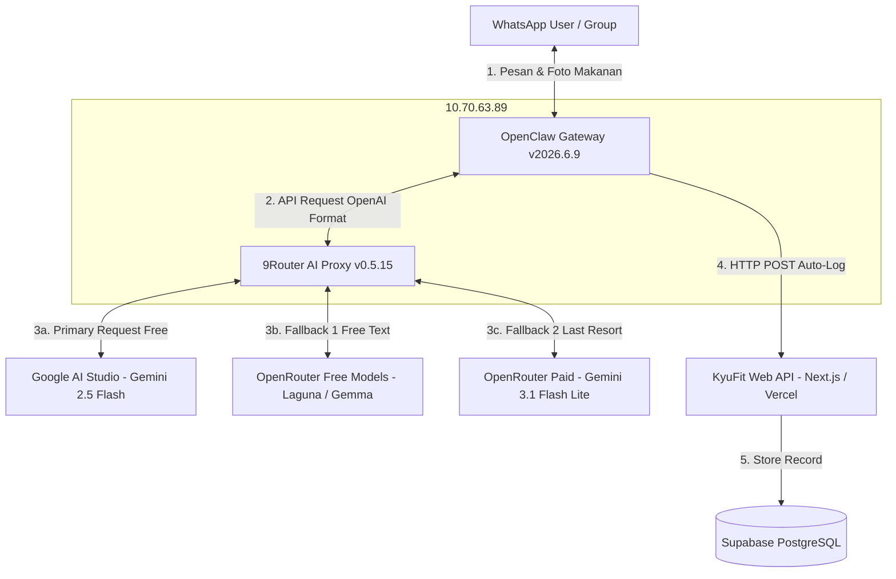

# Dokumentasi Arsitektur & Operasional: WhatsApp AI Bot (Kyu) & KyuFit Ecosystem

Dokumen ini merupakan Panduan Operasional Standar (SOP) dan Spesifikasi Arsitektur Teknis untuk sistem **WhatsApp AI Assistant ("Kyu")** yang terintegrasi dengan platform **KyuFit**. Sistem ini berjalan menggunakan komponen **OpenClaw Gateway**, **9Router AI Proxy**, dan **Next.js Full-Stack Web Engine**.

---

## 📌 Ringkasan Eksekutif

**Kyu Bot** adalah asisten kesehatan dan kebugaran berbasis Artificial Intelligence (AI) yang menerima pesan teks serta foto makanan dari pengguna via WhatsApp, melakukan estimasi kalori dan makronutrisi secara instan menggunakan Vision LLM, lalu mencatat data nutrisi secara otomatis ke basis data KyuFit via API.

---

## 🎯 Latar Belakang & Analisis Masalah

### 1. Keterbatasan Infrastruktur Cloud VPS Gratisan (GCP Free Tier)
* **Masalah**: Percobaan awal menggunakan Google Cloud Platform (GCP) Compute Engine `e2-micro` (1GB RAM) mengalami beberapa kendala serius:
  * Server sering *crash / out-of-memory (OOM)* saat memproses buffer gambar makanan berukuran besar.
  * Sesi WhatsApp Web sering terputus (*session disconnect / socket drop*) akibat pembatasan CPU/RAM.
  * Respon balasan bot lambat (> 15-20 detik per gambar).
* **Solusi**: Memindahkan komponen Bot Gateway dan AI Proxy ke **Host Dedicated Lokal / Laptop Standby (Host LAN/ZeroTier: `10.70.63.89`)** dengan spesifikasi **8 vCPU dan 7.5GB RAM**.

### 2. Batasan Kuota API (Rate Limit / Quota Exceeded)
* **Masalah**: Penggunaan model `gemini-2.5-flash` langsung dari Google AI Studio *Free Tier* dibatasi **20 request/hari**. Ketika limit tercapai, Google mengembalikan `HTTP 429 RESOURCE_EXHAUSTED` yang menyebabkan bot sempat berhenti merespon.
* **Solusi**: Mengimplementasikan **Multi-Tier Model Failover Strategy** pada OpenClaw & 9Router agar bot secara otomatis beralih ke model cadangan gratis/berbiaya rendah jika provider utama terkena limit, tanpa memutus interaksi dengan pengguna.

---

## 💡 Analisis Kebutuhan Sistem

### Kebutuhan Fungsional (Functional Requirements)
1. **Vision AI Nutrisi**: Mampu menganalisis foto makanan/minuman dan mengestimasi Kalori (kCal), Protein (g), Karbohidrat (g), dan Lemak (g) dengan format output *Kalg.ai Style v1.2*.
2. **Auto Data Logging**: Mengirimkan data nutrisi yang telah dikonfirmasi pengguna langsung ke REST API KyuFit (`https://kyufit-app.vercel.app/api/logs/add`).
3. **Multi-Model Support**: Mengintegrasikan provider AI utama (Google AI Studio) dan provider cadangan (OpenRouter) melalui proxy tunggal.

### Kebutuhan Non-Fungsional (Non-Functional Requirements)
1. **High Availability**: Bot harus aktif 24/7 dan toleran terhadap kegagalan API provider (*failover-ready*).
2. **Cost Efficiency**: Penggunaan model harian diutamakan 100% **Gratis ($0)**, dan hanya menggunakan model berbayar hemat sebagai opsi terakhir (*last resort*).
3. **Security & Privacy**: Mengisolasikan API Key, mengamankan token JWT, dan membatasi akses command gateway.

---

## 🏗️ Spesifikasi Arsitektur Sistem



### Komponen Utama:
* **Host Platform**: Standby Laptop (`10.70.63.89`), OS Linux Ubuntu, 8 vCPU, 7.5GB RAM.
* **Bot Gateway**: OpenClaw Gateway (`v2026.6.9`) berjalan sebagai `systemd` user service (`openclaw-gateway.service`).
* **AI Router**: 9Router Proxy (`v0.5.15`) berjalan di bawah PM2 (`127.0.0.1:20128/v1`).
* **Database & Cloud**: Supabase Cloud PostgreSQL & Next.js 16 Web Dashboard ter-deploy di Vercel.

---

## 🛡️ Kebijakan Resilience & Model Failover

Untuk menjamin ketersediaan tinggi tanpa memicu pembengkakan biaya, urutan failover dikonfigurasi sebagai berikut:

### 1. Jalur Teks (Text Messages & Commands)
1. **Primary**: `9router/gemini/gemini-2.5-flash` *(Google AI Studio Direct - 100% Gratis)*
2. **Fallback 1**: `9router/openrouter/poolside/laguna-m.1:free` *(OpenRouter Free)*
3. **Fallback 2**: `9router/openrouter/google/gemma-4-31b-it:free` *(OpenRouter Free)*
4. **Last Resort**: `9router/openrouter/google/gemini-3.1-flash-lite` *(OpenRouter Paid - Opsi Terakhir)*

### 2. Jalur Analisis Gambar (Vision / Image Processing)
1. **Primary**: `9router/gemini/gemini-2.5-flash` *(Google AI Studio Direct - 100% Gratis)*
2. **Last Resort**: `9router/openrouter/google/gemini-3.1-flash-lite` *(OpenRouter Paid - Opsi Terakhir)*

> [!IMPORTANT]
> Model berbayar non-bebas seperti `gpt-4o-mini` telah **didelete 100%** dari konfigurasi untuk mencegah pemotongan saldo tidak terduga.

---

## 🛠️ Langkah Implementasi & Setup Teknis

### Langkah 1: Registrasi API Key Google AI Studio
1. Buka [Google AI Studio](https://aistudio.google.com/).
2. Buat API Key baru di bawah project *Free Tier*.
3. Simpan API Key Anda dengan aman.

### Langkah 2: Instalasi & Daemonisasi 9Router Proxy
Jalankan 9Router pada host laptop di bawah pengelolaan PM2:
```bash
npm install -g 9router
DATA_DIR=/home/parkee/.9router pm2 start 9router --name 9router -- --tray --no-browser
pm2 save
```

### Langkah 3: Konfigurasi OpenClaw Resilience (`openclaw.json`)
File konfigurasi `/home/parkee/.openclaw/openclaw.json` diatur dengan struktur failover:

```json
{
  "agents": {
    "defaults": {
      "workspace": "/home/parkee/.openclaw/workspace",
      "models": {
        "9router/gemini/gemini-2.5-flash": {},
        "9router/openrouter/poolside/laguna-m.1:free": {},
        "9router/openrouter/google/gemma-4-31b-it:free": {},
        "9router/openrouter/google/gemini-3.1-flash-lite": {}
      },
      "model": {
        "primary": "9router/gemini/gemini-2.5-flash",
        "fallbacks": [
          "9router/openrouter/poolside/laguna-m.1:free",
          "9router/openrouter/google/gemma-4-31b-it:free",
          "9router/openrouter/google/gemini-3.1-flash-lite"
        ]
      },
      "imageModel": {
        "primary": "9router/gemini/gemini-2.5-flash",
        "fallbacks": [
          "9router/openrouter/google/gemini-3.1-flash-lite"
        ]
      }
    }
  },
  "models": {
    "providers": {
      "9router": {
        "baseUrl": "http://127.0.0.1:20128/v1",
        "apiKey": "<YOUR_9ROUTER_API_KEY>",
        "api": "openai-completions"
      }
    }
  }
}
```

Setelah memperbarui file, lakukan restart service:
```bash
systemctl --user restart openclaw-gateway.service
```

### Langkah 4: Kustomisasi Workspace & Skill Kyu
Aturan dan instruksi asisten disimpan pada `/home/parkee/.openclaw/workspace/`:
* **`IDENTITY.md`**: Mengatur nama bot (**Kyu**) dan persona asisten yang cerdas.
* **`SOUL.md`**: Mengatur gaya bicara santai, humoris, berwawasan fitness (*Tech-Indonesian*).
* **`TOOLS.md`**: Menyimpan endpoint API KyuFit (`https://kyufit-app.vercel.app/api/logs/add`).
* **`AGENTS.md`**: Memuat SOP operasional kerja, panduan troubleshooting Kafka/PostgreSQL, serta modul estimasi nutrisi.

---

## ⚡ SOP Operasional & Troubleshooting Cheat Sheet

### 1. Monitoring Log Real-Time
* **Log OpenClaw Gateway (WhatsApp & Agent)**:
  ```bash
  journalctl --user -u openclaw-gateway.service -f
  ```
* **Log 9Router Proxy**:
  ```bash
  pm2 logs 9router
  ```

### 2. Manajemen Layanan (Restart / Stop / Start)
* **Restart OpenClaw Service**:
  ```bash
  systemctl --user restart openclaw-gateway.service
  ```
* **Restart 9Router Service**:
  ```bash
  pm2 restart 9router
  ```

### 3. Penanganan Insiden Cepat (Troubleshooting)
* **Pesan WA Tidak Terbalas**: Periksa status OpenClaw (`systemctl --user status openclaw-gateway.service`). Jika log menunjukkan error 429 pada provider tertentu, pastikan failover model di `openclaw.json` terkonfigurasi dengan benar.
* **Gagal Log ke Database**: Pastikan URL di `TOOLS.md` mengarah ke endpoint HTTPS yang valid (`https://kyufit-app.vercel.app/api/logs/add`) dan database Supabase aktif.
