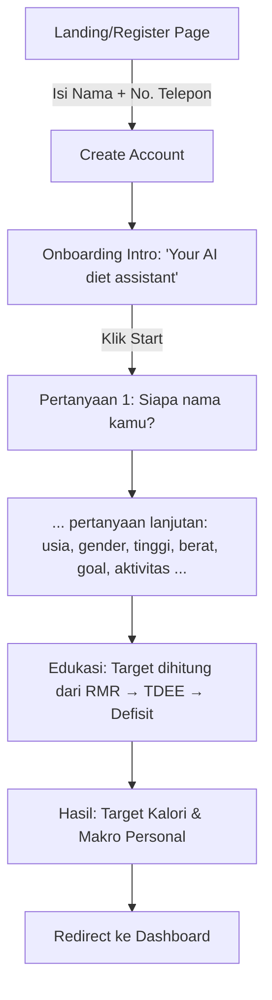
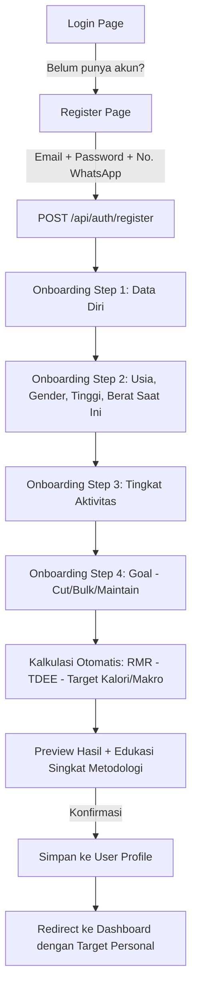

# Rekomendasi Spec: Register, Onboarding & TDEE Calculator KyuFit
## (Referensi: Alur Register & Onboarding Kalg AI)

> [!NOTE]
> Dokumen ini adalah kelanjutan dari review login page KyuFit, disusun setelah keputusan bahwa **KyuFit akan dikembangkan ke arah multi-user** dan akan menambahkan **kalkulator TDEE otomatis** seperti Kalg AI. Dokumen ini membandingkan alur Kalg AI dengan kondisi KyuFit saat ini, lalu memberikan rekomendasi spec baru.

**Konteks Keputusan:**
- ✅ KyuFit akan dikembangkan untuk mendukung multi-user ke depan (bukan personal-only lagi)
- ✅ Kalkulator TDEE otomatis (seperti Kalg) akan ditambahkan sebagai fitur onboarding

---

## 1. Gap Analysis: Login Page Saat Ini vs Kebutuhan Multi-User

| Item | Kondisi Saat Ini | Kebutuhan untuk Multi-User |
|---|---|---|
| Halaman Register | ❌ Tidak ada | ✅ Wajib ada |
| Metode input identitas | Email + Password (hardcoded 1 akun) | Perlu skema registrasi generik (email/password ATAU nomor WA + OTP) |
| Link "Daftar" di halaman login | ❌ Tidak ada | ✅ Wajib ditambahkan |
| Link "Lupa Password" | ❌ Tidak ada | ✅ Direkomendasikan |
| Onboarding data personal (usia, gender, tinggi, berat, goal) | ❌ Tidak ada — target kalori masih hardcoded (1779 kcal) | ✅ Wajib, agar setiap user dapat target personal |
| Kalkulasi target kalori otomatis | ❌ Manual/fixed | ✅ Otomatis via rumus TDEE |
| Validasi & error handling saat register/login | ❓ Belum diketahui | ✅ Wajib (email sudah terdaftar, password lemah, dsb) |

---

## 2. Perbandingan Alur: Kalg AI vs Rekomendasi KyuFit

### 2.1 Alur Kalg AI (Observasi dari Screenshot)



**Karakteristik Kalg:**
- Registrasi ringan: hanya **Nama + Nomor Telepon** (tidak ada password — kemungkinan otentikasi via OTP WhatsApp, konsisten dengan model bisnis mereka yang WhatsApp-native)
- Onboarding berbentuk **conversational form** (Typeform-style), satu pertanyaan per layar — terasa ringan & tidak membebani user
- Ada **momen edukasi** di tengah alur (menjelaskan metodologi RMR/TDEE) sebelum menampilkan hasil — ini membangun kepercayaan user terhadap angka yang dihasilkan
- Setelah onboarding selesai, user baru diarahkan ke dashboard dengan target yang **sudah personal**, bukan generic

### 2.2 Rekomendasi Alur untuk KyuFit



**Perbedaan pendekatan yang disarankan:**
- KyuFit tetap pakai **Email + Password** (bukan OTP WA) karena sudah ada foundation auth email/password dari spec sebelumnya — lebih cepat diimplementasikan, tidak perlu integrasi WA Business API untuk OTP
- Nomor WhatsApp tetap diminta saat register (untuk sinkronisasi bot, sesuai fitur eksis), tapi bukan sebagai metode login
- Onboarding tidak harus meniru Typeform (butuh third-party service), cukup **multi-step form dalam 1 halaman React** dengan progress indicator — lebih murah & terintegrasi langsung ke stack Next.js yang sudah ada

---

## 3. Metodologi Kalkulasi Target Kalori (RMR → TDEE → Defisit/Surplus)

Mengikuti pendekatan yang disebutkan Kalg (Mifflin-St Jeor Equation), berikut rumus yang direkomendasikan:

### Step 1: Hitung RMR (Resting Metabolic Rate)
Menggunakan **Mifflin-St Jeor Equation**:

- **Pria:** `RMR = (10 × berat_kg) + (6.25 × tinggi_cm) - (5 × usia) + 5`
- **Wanita:** `RMR = (10 × berat_kg) + (6.25 × tinggi_cm) - (5 × usia) - 161`

### Step 2: Hitung TDEE (Total Daily Energy Expenditure)
RMR dikalikan dengan faktor aktivitas:

| Tingkat Aktivitas | Faktor Pengali |
|---|---|
| Sedentary (jarang olahraga) | × 1.2 |
| Lightly active (olahraga 1-3x/minggu) | × 1.375 |
| Moderately active (olahraga 3-5x/minggu) | × 1.55 |
| Very active (olahraga 6-7x/minggu) | × 1.725 |
| Extra active (fisik berat/atlet) | × 1.9 |

### Step 3: Terapkan Defisit/Surplus Sesuai Goal

| Goal | Penyesuaian |
|---|---|
| Cut (turun berat badan) | TDEE − 15% s/d 20% |
| Maintain (stabil) | TDEE (tanpa penyesuaian) |
| Bulk (naik berat badan) | TDEE + 10% s/d 15% |

### Step 4: Hitung Distribusi Makro (opsional, default ratio)

| Makro | Default Ratio | Kalori per gram |
|---|---|---|
| Protein | 30% dari total kalori | 4 kcal/g |
| Carbs | 45% dari total kalori | 4 kcal/g |
| Fat | 25% dari total kalori | 9 kcal/g |

> Ratio makro ini bisa dijadikan default, dengan opsi advanced settings bagi user yang ingin custom ratio-nya sendiri.

---

## 4. Perubahan Skema Database yang Diperlukan

Tabel `User` perlu ditambahkan kolom-kolom berikut agar kalkulasi TDEE bisa dilakukan:

```prisma
model User {
  // ... kolom eksis ...
  age               Int?
  gender            String?   // "male" | "female"
  heightCm          Float?
  currentWeightKg   Float?
  activityLevel     String?   // "sedentary" | "light" | "moderate" | "active" | "extra_active"
  fitnessGoal       String    @default("maintain") // "cut" | "bulk" | "maintain"
  onboardingComplete Boolean  @default(false)
  macroRatio        Json?     // custom override, default null = pakai default ratio
}
```

**Catatan:** Kolom `dailyCalorieTarget`, `targetProteinG`, `targetCarbsG`, `targetFatsG` yang sudah ada di spec v1.0 tetap dipakai — hanya saja nilainya sekarang **dihasilkan dari kalkulasi**, bukan hardcoded default.

---

## 5. API Endpoints Baru yang Diperlukan

| Endpoint | Method | Deskripsi |
|---|---|---|
| `/api/auth/register` | POST | Membuat akun baru (email, password, nama, nomor WA) |
| `/api/onboarding/calculate` | POST | Terima data diri (usia, gender, tinggi, berat, aktivitas, goal) → return hasil kalkulasi RMR/TDEE/target tanpa menyimpan (untuk preview) |
| `/api/onboarding/complete` | POST | Simpan data onboarding final ke tabel `User`, set `onboardingComplete = true` |
| `/api/user/recalculate` | POST | Untuk user existing yang ingin update data diri & re-kalkulasi target (mis. berat badan berubah signifikan) |

---

## 6. Rekomendasi UI: Halaman Login (Update)

Perubahan minimal yang disarankan pada halaman login saat ini:

1. Tambahkan teks di bawah tombol "Masuk": *"Belum punya akun? **Daftar di sini**"* (link ke `/register`)
2. Tambahkan link kecil *"Lupa password?"* di atas atau di bawah field password
3. Tambahkan error state (border merah + pesan error) untuk kredensial salah
4. Tambahkan loading state pada tombol "Masuk" (spinner + disabled saat proses)

---

## 7. Rekomendasi UI: Halaman Register (Baru)

Mengikuti kesederhanaan Kalg tapi disesuaikan dengan kebutuhan auth email/password KyuFit:

**Field yang diminta:**
- Nama Lengkap
- Email
- Password (+ konfirmasi password)
- Nomor WhatsApp (untuk sinkronisasi bot)

**Setelah submit:** langsung lanjut ke flow onboarding (Step 1: Data Diri), bukan langsung ke dashboard — supaya target kalori sudah personal sejak awal, bukan default generic.

---

## 8. Rekomendasi UI: Onboarding Multi-Step

Alih-alih Typeform (dependency eksternal), disarankan multi-step form dalam satu halaman `/onboarding` dengan:

- Progress bar/indicator di atas (mis. "Step 2 dari 4")
- Satu grup pertanyaan per step (agar tidak overwhelming, senada dengan pendekatan "1 pertanyaan per layar" ala Kalg tapi dikelompokkan biar lebih ringkas — tidak perlu 10+ layar terpisah)
- Step edukasi singkat (card kecil, bukan full page) yang menjelaskan metodologi RMR → TDEE → Target sebelum preview hasil akhir
- Preview hasil kalkulasi (kalori & makro) dengan opsi "Sesuaikan Manual" sebelum konfirmasi final

**Saran pembagian step:**
1. **Step 1:** Usia, Gender, Tinggi, Berat saat ini
2. **Step 2:** Tingkat Aktivitas (pilihan visual/card, bukan dropdown polos)
3. **Step 3:** Goal (Cut/Bulk/Maintain) + target waktu (opsional)
4. **Step 4:** Preview hasil + edukasi metodologi + tombol konfirmasi

---

## 9. Prioritas Implementasi (Update dari Roadmap Sebelumnya)

Roadmap sebelumnya (Login → Date Nav → Workout → Energy Ring) perlu disisipi fase baru:

1. **Auth Dasar** — Login (update dengan link register) + `/api/auth/login`, `/logout`, `/me`
2. **🆕 Register Flow** — Halaman register + `/api/auth/register`
3. **🆕 Onboarding & TDEE Calculator** — Schema update, multi-step form, `/api/onboarding/*`
4. **Date Navigation Bar**
5. **Workout/Gym Tracking**
6. **Energy Balance Ring (Intake vs Exhaust)**
7. **UI Polish**

---

## 10. Pertanyaan Terbuka untuk Klarifikasi

- [ ] Untuk multi-user, apakah tetap pakai email+password, atau ingin mempertimbangkan OTP WhatsApp seperti Kalg (lebih kompleks, butuh WA Business API)?
- [ ] Apakah user existing (Rifaldi) perlu "dipaksa" mengisi onboarding juga agar datanya konsisten dengan user baru, atau datanya di-migrate manual?
- [ ] Ratio makro default (30/45/25) apakah sudah sesuai, atau ada preferensi lain?
- [ ] Apakah butuh fitur "Recalculate" otomatis ketika berat badan user berubah signifikan (mis. tiap turun 2kg, sistem prompt untuk update target)?