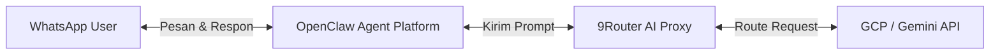

# Panduan Setup WhatsApp Bot (GCP + 9Router + OpenClaw)

Dokumen ini menjelaskan tahapan lengkap dan arsitektur untuk membangun WhatsApp Bot berbasis AI Agent menggunakan **Google Cloud Platform (GCP)**, **9Router** sebagai proxy model AI, dan **OpenClaw** sebagai pengelola channel WhatsApp serta logika agent.

---

## 🏗️ Arsitektur & Alur Kerja



1. **GCP (Infrastruktur & API Key)**: Menyediakan VPS (Compute Engine) untuk menjalankan bot 24/7 serta API Key Gemini/GCP Agent Platform.
2. **9Router (AI Gateway/Proxy)**: Berjalan secara lokal untuk mengelola API keys, mengoptimalkan token input/output, dan menangani fallback antar model.
3. **OpenClaw (AI Agent & Channel)**: Menghubungkan ke WhatsApp Web protocol, menerima pesan, memprosesnya lewat model AI via 9Router, dan mengirim kembali balasannya.

---

## 🛠️ Langkah-Langkah Implementasi

### Langkah 1: Persiapan GCP & API Key

1. **GCP VM Instance**: Buat VM Instance baru di GCP Compute Engine (rekomendasi: OS Ubuntu/Debian, spesifikasi minimal `e2-small` atau `e2-medium` with RAM minimal 2GB agar WhatsApp Web session stabil).
2. **Dapatkan API Key**:
   * Sesuai dengan screenshot panel GCP Agent Platform Anda, gunakan API Key yang sudah dibuat:
     ```text
     `<YOUR_GEMINI_API_KEY>`
     ```
   * Key ini akan digunakan di 9Router sebagai autentikasi ke Google Gemini API.

---

### Langkah 2: Instalasi & Konfigurasi 9Router

9Router akan berfungsi sebagai backend proxy lokal untuk meneruskan request dari OpenClaw ke GCP Gemini.

#### Opsi A: Menggunakan Docker (Direkomendasikan untuk VPS GCP)
Jalankan perintah berikut untuk menjalankan 9Router di background dengan penyimpanan data persistent:
```bash
docker run -d \
  -p 20128:20128 \
  -v "$HOME/.9router:/app/data" \
  -e DATA_DIR=/app/data \
  --name 9router \
  --restart unless-stopped \
  decolua/9router:latest
```

#### Opsi B: Menggunakan NPM (Local/VPS)
Jika ingin menjalankan langsung menggunakan Node.js:
```bash
npm install -g 9router
9router
```

#### Konfigurasi Provider:
1. Buka browser dan akses dashboard 9Router di `http://localhost:20128` (atau `http://<IP-GCP-VM>:20128` jika port dibuka).
2. Masuk ke tab **Providers**.
3. Pilih **Google Gemini / Google AI Studio** dan masukkan API Key:
   `<YOUR_GEMINI_API_KEY>`
4. Simpan konfigurasi. 9Router kini menyediakan endpoint OpenAI-compatible di `http://localhost:20128/v1`.

---

### Langkah 3: Instalasi & Konfigurasi OpenClaw

OpenClaw bertindak sebagai otak dari bot WhatsApp Anda.

1. **Instalasi OpenClaw**:
   ```bash
   npm install -g openclaw@latest
   ```
2. **Jalankan Onboarding Wizard**:
   ```bash
   openclaw onboard
   ```
   * Ikuti petunjuk di layar untuk setup workspace.
   * Saat ditanya mengenai API endpoint / provider, arahkan ke 9Router lokal:
     * **API URL**: `http://localhost:20128/v1`
     * **API Key**: `9router` (atau bebas, karena 9Router lokal tidak mewajibkan auth token secara default jika diakses dari localhost).
     * **Model**: Pilih model Gemini (misal: `gemini-2.5-flash` atau model default yang Anda daftarkan di 9Router).

---

### Langkah 4: Hubungkan Channel WhatsApp

OpenClaw menggunakan plugin terintegrasi untuk membaca dan membalas pesan WhatsApp.

1. **Tambahkan Channel WhatsApp**:
   ```bash
   openclaw channels add --channel whatsapp
   ```
   *(Pilih instal plugin jika diminta).*

2. **Login & Scan QR Code**:
   Jalankan perintah login untuk memicu proses pairing:
   ```bash
   openclaw channels login --channel whatsapp
   ```
   * Terminal akan menampilkan QR code (atau memberikan link/instruksi visual).
   * Buka WhatsApp di HP Anda -> **Linked Devices (Perangkat Tertaut)** -> **Link a Device**.
   * Scan QR code tersebut.

> [!WARNING]
> **Kebijakan Anti-Spam WhatsApp:** 
> Sangat disarankan untuk menggunakan **nomor WhatsApp baru/khusus** (bukan nomor pribadi utama) untuk menghindari risiko blokir nomor akibat aktivitas automasi yang dianggap spam oleh WhatsApp.

---

### Langkah 5: Pembatasan Keamanan (Opsional tapi Penting)

Agar bot WhatsApp Anda tidak merespon ke sembarang grup atau kontak tidak dikenal secara liar, lakukan konfigurasi whitelist pada file konfigurasi OpenClaw (biasanya terletak di `~/.openclaw/config.toml` atau file konfigurasi workspace Anda):

```toml
[channels.whatsapp]
# Hanya merespon nomor-nomor tertentu (format internasional tanpa tanda +)
allowFrom = ["628123456789", "628987654321"]
```

---

## 🚀 Menjalankan Bot di Background (Production)

Agar bot Anda terus berjalan di GCP VM setelah Anda menutup koneksi SSH, gunakan **PM2** (Process Manager):

1. **Instal PM2**:
   ```bash
   npm install -g pm2
   ```
2. **Jalankan OpenClaw**:
   ```bash
   pm2 start openclaw --name "wa-bot" -- start
   ```
3. **Pastikan Startup Otomatis saat VM reboot**:
   ```bash
   pm2 startup
   pm2 save
   ```

Sekarang bot WhatsApp Anda siap digunakan dan akan merespon pesan secara otomatis menggunakan AI dari GCP via 9Router!
